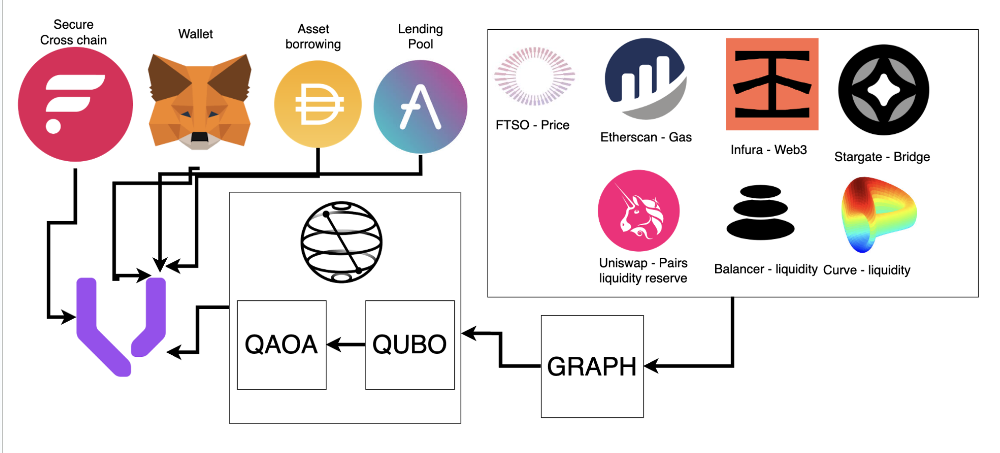

# Quantum-Enhanced Cross-Chain Arbitrage Bot (QXAB) on Flare  

Built by [Tom](https://www.linkedin.com/in/thomas-bale-5863542a4/), [Dhillon](https://www.linkedin.com/in/dhillon-thurairatnam/), and [Ella](github.com/cowboyella) - Team EthumBards for the ETH Oxford Hackathon  

## Overview  
**Quantum-Enhanced Cross-Chain Arbitrage Bot (QXAB)** is an innovative arbitrage system that leverages **Quantum Optimization (QAOA)** and **Flare’s blockchain protocols** to execute high-speed, secure, and profitable arbitrage trades across multiple decentralized finance (DeFi) ecosystems with **Vyper** contracts.  

### Key Features  
- **Quantum Speed Boost** – Uses Quantum Approximate Optimization Algorithm (QAOA) for rapid arbitrage path discovery.  
- **Flare’s FTSO (Time Series Oracle) Integration** – Fetches **real-time cross-chain price feeds** securely.  
- **Flare’s State Connector** – Ensures **trustless execution** of cross-chain swaps.  
- **Cross-Chain Flash Loans** – Utilizes **Aave, Uniswap, Curve, and Flare lending pools**.  
- **Risk-Free Arbitrage** – Trades execute only when **guaranteed profit** is detected.  

---

## Architecture Diagram



---

## Installation & Setup  

### Backend
```
cd code/web-app
brew install docker
brew install docker-compose
docker compose up --build
```

### Frontend
```
cd code/web-app/qxab-frontend
npm i
npm run dev
```

---

## How It Works  
1. **Fetch real-time price feeds** from Flare’s **FTSO oracle**.  
2. **Run quantum optimization** (QAOA) to determine the best arbitrage path.  
3. **Validate blockchain states** using **Flare’s State Connector**.  
4. **Execute a flash loan** to borrow assets.  
5. **Swap assets across DEXs & repay the loan with profit**.  

---

## Potential Impact  
- **High-speed quantum arbitrage** with Flare’s **real-time oracles**.  
- **Seamless cross-chain trading** using **State Connector**.  
- **Fully decentralized, secure, and optimized arbitrage**.  

---

## Next Steps  
- Improve **QAOA model** for better arbitrage pathfinding.  
- Expand support for **more DeFi lending protocols**.  
- Deploy on **Ethereum Mainnet, BSC, Solana, and Flare**.  

Want to contribute? Fork the repo and submit a PR!  

---

Let me know if you need further modifications.
